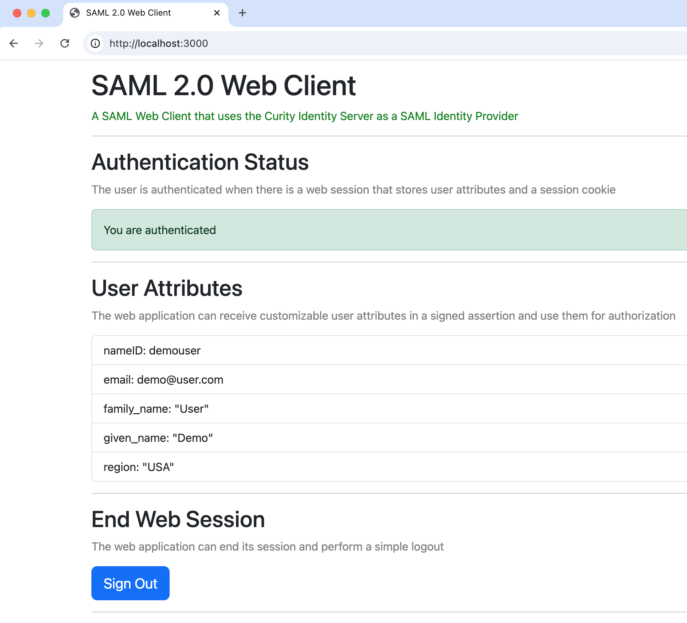

# SAML 2.0 Web Client

[](https://curity.io/resources/code-examples/status/)
[](https://curity.io/resources/code-examples/status/)

A basic web client that uses SAML to authenticate users at the Curity Identity Server.

## Security Modernization

You can integrate with [existing data sources](DATA.md) and control over user attributes issued to SAML assertions.\
The example app uses some built-in identity attributes and a custom attribute for the region value.



Control over user attributes enables business continuity during migrations.\
Often, a DevOps team can perform a migration with zero or minimal code changes:

- Configure SAML settings in the Curity Identity Server.
- Update the app's environment variables.

The app can then use all of the Curity Identity Server's modern authentication features:

- Custom themes per application, to provide your preferred login user experience.
- Built-in authenticators with modern methods like like passkeys and verifiable credentials.
- Authentication actions that enable detailed control over authentication workflows.
- An SDK that enable custom authenticators or authentication actions, so that you are never blocked.

## How to Run the Code Example

Use the following commands to run a basic SAML flow on a local computer.

### Prerequisites

First, get a license file for the Curity Identity Server with access to the SAML feature.\
Also make sure that you local computer runs Docker, the OpenSSL tool and the jq tool.

### Deploy the Curity Identity Server

Then run the deploy script to spin up a local server instance:

```bash
export LICENSE_FILE_PATH=~/Desktop/license-trial.json
./idsvr/deploy.sh
```

Sign in to the Admin UI at `https://localhost:6749/admin` with credentials `admin / Password1`.\
Use the facilities menu to export the certificate of the default signing key.\
Save it to the root folder of this project with the name `default-signing-key.pem`.

### Run the Web Application

Next, run the web application with the following commands:

```bash
npm install
npm start
```

Open the browser at `http://localhost:3000` and sign in as the pre-shipped user `demouser / Password1`.\
The app does a SAML login and receives a signed assertion with user attributes.\
The app then issues cookies, runs a web session and can implement authorization with the assertion's user attributes.

### Query Data

## Website Documentation

See the following related information for further details on SAML integrations:

- [SAML Website Code Example](https://curity.io/resources/learn/saml-web-client/)
- [Integrate a SAML Web Application](https://curity.io/resources/learn/saml-integration/)

## Further Information

Please visit [curity.io](https://curity.io/) for further information about the Curity Identity Server.
